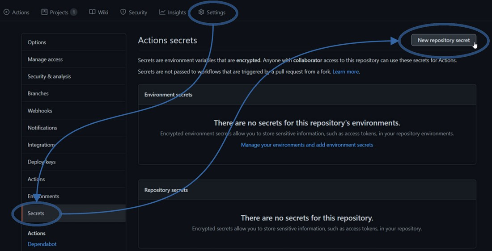
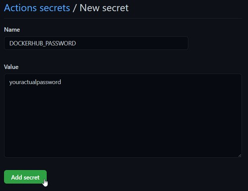
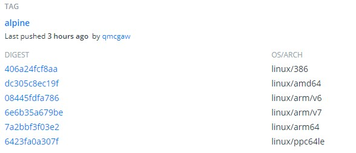

We will design a continous integration (CI) using Github Actions to automatically build a simple Alpine based Docker image for every CPU architecture supported by Docker.

The final image will only print the machine type for this experiment using `uname -m`.

Make sure to check out the [Conclusion](Conclusion) which highlights more posts about Docker image cross compilation with programming languages such as Go.

## Prerequisites

1. Have a [Github account](https://github.com/join)
1. Have a [Github repository](https://github.com/new)

## Repository setup

Have this minimal file structure in your repository:

```s
.
├── .git
├── .github
|   └── workflows
|       └── docker.yml
└── Dockerfile
```

### `Dockerfile`

```Dockerfile
# Always pin your image version
ARG ALPINE_VERSION=3.13

FROM alpine:${ALPINE_VERSION}
ENTRYPOINT [ "uname -m" ]
```

This image will just show the CPU architecture of the Alpine system.

You can try with:

```sh
docker build -t test .
docker run -it --rm test
```

And it will show your native architecture, usually `x86_64`.

### Github workflow `docker.yml`

Let's start with a minimal code in `.github/workflows/docker.yml`:

```yml
name: docker
on:
  push:
    paths:
      - .github/workflows/docker.yml
      - Dockerfile
  pull_request:
    paths:
      - .github/workflows/docker.yml
      - Dockerfile

jobs:
  verify:
    runs-on: ubuntu-latest
    env:
      DOCKER_BUILDKIT: "1"
    steps:
      - uses: actions/checkout@v2

      - name: Build image
        run: docker build .
```

This workflow will only trigger if both of these conditions are met:

1. `docker.yml` and/or `Dockerfile` is modified
2. A `push` or a `pull_request` is made on the repository

A `push` means a `git push` on the main branch or any branch of the repository.

A `pull_request` is when a pull request is made, either from the same repository or the forked repository.

The workflow has only one job called `verify` which simply builds the Docker image without saving it.
This is useful to have a quick failure detection mechanism building and targeting your native OS, since cross CPU architecture compilation is slower.

### The `publish` job

Let's add the `publish` job to your `docker` workflow.

Its task will be to cross CPU build your Docker image and push them to Docker Hub.

It should only trigger on `push` events such that:

- Pull requests from forked repositories do not trigger it, for obvious security reasons
- To avoid duplicating the task when pushing to a branch with an opened pull request

Add this block below the `verify` job block:

```yml
  publish:
    needs: [verify]
    if: github.event_name == 'push'
    runs-on: ubuntu-latest
    steps:
      - uses: actions/checkout@v2

      - uses: docker/setup-qemu-action@v1
      - uses: docker/setup-buildx-action@v1

      - uses: docker/login-action@v1
        with:
          username: dockerhubuser
          password: ${{ secrets.DOCKERHUB_PASSWORD }}

      - name: Set image tag variable
        id: vars
        env:
          EVENT_NAME: ${{ github.event_name }}
        run: |
          BRANCH=${GITHUB_REF#refs/heads/}
          TAG=${GITHUB_REF#refs/tags/}
          if [ "$TAG" != "$GITHUB_REF" ]; then
            echo ::set-output name=tag::$TAG
          elif [ "$BRANCH" = "main" ]; then
            echo ::set-output name=tag::latest
          else
            echo ::set-output name=tag::$BRANCH
          fi

      - name: Cross build and push final images
        uses: docker/build-push-action@v2
        with:
          platforms: linux/amd64,linux/386,linux/arm64,linux/arm/v7,linux/arm/v6,linux/s390x,linux/ppc64le,linux/riscv64
          tags: |
            yourdockerhubusername/testimage:${{ steps.vars.outputs.tag }}
          push: true
```

Now let's replace some values:

1. Replace `yourdockerhubusername` with your actual Docker Hub username, for example mine is `qmcgaw`
1. If you main branch is called `master` and not `main`, replace `main` with `master`

Finally, go to your Github repository settings to add your Docker hub password as a secret





## Run it

Finally add your files to Git and push it to Github

```sh
git add .
git commit -m "Github workflow to build Docker images"
git push
```

This will trigger the workflow you can see in `https://github.com/youruser/yourrepo/actions`

## Docker Hub

You can go to your Docker Hub repository tags page at

```text
https://hub.docker.com/r/yourdockerhubusername/testimage/tags
```

And you should see the image with all the CPU architectures. For example, mine looks like:



## Pull it

Now let's try running it pretending we're another CPU architecture such as `arm64`.

```sh
docker run -it --rm --platform=linux/arm64 yourdockerhubusername/testimage
```

And that should print `aarch64` meaning it will automagically pull the right image for the right architecture.

## Conclusion

This allows you to build and push Docker images for multiple architectures.

Note however that this can be limited depending on the base image OS you use.

Alpine has good support for all CPU architectures, but that is really not the case always.

If you build your own program, you should also make sure it is compatible with the target CPU architecture.

Finally, since building images for other target CPU architectures run with an emulation layer (qemu), this can be quite slower than building natively. For languages allowing you to cross build natively such as Go or Rust, you should instead build your binaries on the build platform without emulation.

ℹ️ [How to cross build Docker images with Go programs using the Go toolchain](cross-cpu-docker-images-using-go)
