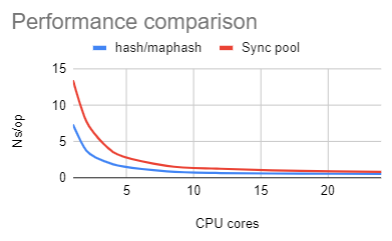

This post is about how to generate uniformly distributed numbers thread safely and as fast as possible.
It does involve randomness but we do not aim at generating cryptographically secured random numbers.

The use cases vary, but a common example is to pick an element from a slice uniformly for each HTTP request in an HTTP server.

Given the way the `net/http` library is, one cannot fiddle with the entrypoint before the request handling is launched in its own goroutine. So using a thread safe random number generator is necessary, which should be called from within each of the goroutine handling the HTTP request.

In my specific case, I needed this for [`github.com/qdm12/dns`](https://github.com/qdm12/dns) in order to pick uniformly an upstream DNS over TLS/HTTPs public provider URL for each DNS request... and also because I wanted it to be fast as a fun experiment!

## Uniform distribution test

To verify our implementations do generate uniformly distributed numbers, we need a test to pass or fail.

The following test helper function is used to verify numbers modulo `n` produced by the function `f` are uniformly distributed:

```go
func isUniformlyDistributed(t *testing.T, f func(n int) int) {
    t.Helper()

    const iterations = 100000
    const maxValue = 30

    numberToCount := make(map[int]int, maxValue)

    for i := 0; i < iterations; i++ {
        out := f(maxValue)
        numberToCount[out]++
    }

    targetGenerationsPerNumber := iterations / maxValue
    const maxPercentDivergence = 0.07

    for number := 0; number < maxValue; number++ {
        count := numberToCount[number]

        diff := targetGenerationsPerNumber - count
        if diff < 0 {
            diff = -diff
        }
        divergence := float64(diff) / float64(targetGenerationsPerNumber)
        if divergence > maxPercentDivergence {
            t.Errorf("Number %d was generated %d times, with a %.2f%% divergence from the target %d",
                number, count, 100*divergence, targetGenerationsPerNumber)
        }
    }
}
```

It runs the number generation function `10000` times, generating numbers modulo `30`.
The output is recorded and checked against the target count of `10000` / `30` = `333`.
If it diverges more than `7%` from it, the test fails.

I chose `10000` iterations, a modulo of `30` and a maximum divergence of `7%` basing it on the minimum/maximum values possible using the cryptographically secured random generator `crypto/rand`:

```go
func Test_CryptoRand(t *testing.T) {
    f := func(n int) int {
        buffer := make([]byte, 8)
        _, _ = cryptorand.Read(buffer)
        uintOut := binary.BigEndian.Uint64(buffer)
        out := int(uintOut)
        if out < 0 {
            out = -out
        }
        return out % n
    }
    isUniformlyDistributed(t, f)
}
```

Now each method described below will be tested with the same test helper to ensure it produces the same level of uniform distribution as the cryptographic random generator.

The final test file is available as a Github gist [**here**](https://gist.github.com/qdm12/75a1c5175d764f6a0f77a89521cf50c6#file-test_test-go)

## Benchmarking setup

Each benchmark will aim at finding an `int` between `0` and `100` picked uniformly.

To benchmark each of these methods, we use Go's `b.RunParallel` in order to test the performance with all the CPU cores active.
This allows to check the performance impact of lock contention if for example a mutex is used.

The CPU used is an AMD Ryzen 5900X CPU with 24 virtual cores.

We also use a benchmarking wrapper to try difference CPU cores configuration:

```go
func benchPerCoreConfigs(b *testing.B, f func(b *testing.B)) {
    b.Helper()
    coreConfigs := []int{1, 2, 4, 8, 12, 18, 24}
    for _, n := range coreConfigs {
        name := fmt.Sprintf("%d cores", n)
        b.Run(name, func(b *testing.B) {
            runtime.GOMAXPROCS(n)
            f(b)
        })
    }
}
```

The full benchmark Go source file is available as a Github gist [**here**]((https://gist.github.com/qdm12/75a1c5175d764f6a0f77a89521cf50c6#file-bench_test-go))

For each method tried, there are:

- a runnable benchmark piece of code
- a table showing the benchmark results
  - Nanoseconds per operation `Ns/op` for the following CPU cores configuration:
    - Using 1 core
    - Using 2 cores
    - Using 4 cores
    - Using 8 cores
    - Using 12 cores
    - Using 18 cores
    - Using 24 cores
  - Bytes allocated per operation `B/op`
  - Allocations per operation `allocs/op`
- a description on how it works
- an observation on its performance

## Using `crypto/rand`

```go
func BenchmarkCryptoRandGenerator(b *testing.B) {
    benchPerCoreConfigs(b, func(b *testing.B) {
        b.RunParallel(func(b *testing.PB) {
            for b.Next() {
                buffer := make([]byte, 8)
                _, _ = cryptorand.Read(buffer)
                outUint64 := binary.BigEndian.Uint64(buffer)
                out := int(outUint64)
                if out < 0 {
                    out = -out
                }
                _ = out % 100
            }
        })
    })
}
```

| NS/op | | | | | | | | B/op | allocs/op |
| --- | --- | --- | --- | --- | --- | --- | --- | --- | --- |
| CPU cores | 1 | 2 | 4 | 8 | 12 | 18 | 24 | `0` | `0` |
| Ns/op | `76` | `40` | `21` | `11` | `8.8` | `8.6` | `8.9` |


This approach is thread safe but gathering cryptographically secured bytes is quite slow.
It however scales proportionally with the number of CPU cores active, reaching its peak performance with 12 cores at approximately `9ns/op`.

## Using `math/rand`'s `rand.Intn`

```go
func BenchmarkMathRandGenerator(b *testing.B) {
    benchPerCoreConfigs(b, func(b *testing.B) {
        b.RunParallel(func(b *testing.PB) {
            for b.Next() {
                _ = mathrand.Intn(100)
            }
        })
    })
}
```

| NS/op | | | | | | | | B/op | allocs/op |
| --- | --- | --- | --- | --- | --- | --- | --- | --- | --- |
| CPU cores | 1 | 2 | 4 | 8 | 12 | 18 | 24 | `0` | `0` |
| Ns/op | `6.5` | `21` | `43.5` | `63` | `69` | `78` | `81` |


Producing numbers with a single core is very fast, with 6.5ns/op.
However, the performance degrades as the number of threads and CPU cores increase.
The performance degradation seems to reach a peak of `80ns/op` at about 18 CPU cores/threads.

This degradation is due to the fact `rand.Intn` uses the following `rand.Source`:

```go
type lockedSource struct {
    lk  sync.Mutex
    src Source64
}
```

and every call to it uses the mutex since `rand.Source64` is not thread safe.

That essentially means the lock contention is the root of the degradation.

## Using a mutex locked xorshift generator

This is similar to what `math/rand`'s `rand.Intn` is doing, although the xorshift algorithm makes it slightly faster.

We initially seed the generator with a 64 bit unsigned integer `n` by reading 8 bytes from the cryptographically secure source `crypto/rand`.
Each number generation then runs xor shift on `n`, which is thread locked with a mutex.

```go
func BenchmarkMutexGenerator(b *testing.B) {
    benchPerCoreConfigs(b, func(b *testing.B) {
        makeSeed := func() (seed uint64) {
            b := make([]byte, 8)
            _, _ = rand.Read(b)
            return binary.BigEndian.Uint64(b)
        }

        generator := struct {
            n uint64
            sync.Mutex
        }{
            n: makeSeed(),
        }

        b.RunParallel(func(b *testing.PB) {
            for b.Next() {
                generator.Lock()

                // xorshift
                generator.n ^= generator.n << 13
                generator.n ^= generator.n >> 7
                generator.n ^= generator.n << 17
                outUint64 := generator.n

                generator.Unlock()

                out := int(outUint64)
                if out < 0 {
                    out = -out
                }
                _ = out % 100
            }
        })
    })
}
```

| NS/op | | | | | | | | B/op | allocs/op |
| --- | --- | --- | --- | --- | --- | --- | --- | --- | --- |
| CPU cores | 1 | 2 | 4 | 8 | 12 | 18 | 24 | `0` | `0` |
| Ns/op | `3.9` | `5.4` | `12.3` | `42.9` | `45.7` | `45` | `44.8` |


Single thread performance is better than before and the performance degradation due to the mutex reaches its highest level at about 8 cores.

The following plot compares it with our previous `math/rand`'s `Intn` implementation:


So this is still an improvement over `math/rand`. Although when comparing it with our `crypto/rand` approach, we get:


Showing this method is faster only until we use 5 CPU cores, so we definitely need better!

## Counters

In some situations such as often having to pick an index in a 10 elements slice, we don't really care about the randomness at generating each number and only care about the uniform distribution. In this case, a counter fits the purpose.

### Mutex locked counter

A mutex locked counter is really the same as our mutex locked xorshift generator.
Running the benchmark for it gives the same speed as the xorshift, so there is little point in this method. Its lowest performance is also reached at 8 cores, and is even a bit higher at `50ns/op`.

### Atomic counter

We use the `sync/atomic` package, which involves more specific CPU instructions for more narrowed uses such as incrementing an integer.

```go
func BenchmarkAtomicCounter(b *testing.B) {
    benchPerCoreConfigs(b, func(b *testing.B) {
        counterPtr := new(uint64)
        b.RunParallel(func(b *testing.PB) {
            for b.Next() {
                _ = int(atomic.AddUint64(counterPtr, 1)) % 100
            }
        })
    })
}
```

| NS/op | | | | | | | | B/op | allocs/op |
| --- | --- | --- | --- | --- | --- | --- | --- | --- | --- |
| CPU cores | 1 | 2 | 4 | 8 | 12 | 18 | 24 | `0` | `0` |
| Ns/op | `1.6` | `4.2` | `7.5` | `13` | `12.9` | `13.2` | `13.2` |


Compared to our `crypto/rand` and mutex locked xorshift generator:


The atomic counter is thus faster than both other methods until more than 8 cores are used.
For more than 8 cores, it is slighly slower than `crypto/rand` although its performance does not degrade further as more cores are used and it stays at about `13ns/op`.

## Sync pool

The `sync.Pool` can be leveraged to have a pool of non-thread-safe random generators.

```go
func BenchmarkSyncPool(b *testing.B) {
    benchPerCoreConfigs(b, func(b *testing.B) {
        type generator struct {
            n uint64
        }

        makeSeed := func() (seed uint64) {
            b := make([]byte, 8)
            _, _ = rand.Read(b)
            return binary.BigEndian.Uint64(b)
        }

        pool := &sync.Pool{
            New: func() interface{} {
                return &generator{
                    n: makeSeed(),
                }
            },
        }

        b.RunParallel(func(b *testing.PB) {
            for b.Next() {
                generator := pool.Get().(*generator)

                // xorshift
                generator.n ^= generator.n << 13
                generator.n ^= generator.n >> 7
                generator.n ^= generator.n << 17
                outUint64 := generator.n

                pool.Put(generator)

                out := int(outUint64)
                if out < 0 {
                    out = -out
                }
                _ = out % 100
            }
        })
    })
}
```

| NS/op | | | | | | | | B/op | allocs/op |
| --- | --- | --- | --- | --- | --- | --- | --- | --- | --- |
| CPU cores | 1 | 2 | 4 | 8 | 12 | 18 | 24 | `0` | `0` |
| Ns/op | `13.5` | `7.8` | `3.6` | `1.7` | `1.3` | `1` | `0.87` |


This produces pseudo random generated numbers and cuts down the processing time from `90ns/op` to `15ns/op`, quite impressive.

This works using a fast pseudo random generator as its base unit.
We start with an empty pool of generators, creating a new generator every time there is no available generator to use in the pool.
When a goroutine generates a random number, it 'gets' a random generator from the pool and 'puts' it back in the pool once done.
A `sync.Pool` is designed to scale well with the number of CPU cores.

Each base pseudo random number generator (PRNG) has a single field, `n uint64` which is seeded using the cryptographically secure source `crypto/rand`.
For each PRNG, generating a number consists of a shiftxor on `n`, which is very fast.

This essentially means that creating a new PRNG costs quite some time, but the maximum number of generators is equal to the number of CPU cores. With 4 CPU cores and this benchmark, usually 3 or 4 generators are ever created.

As a consequence, this method generates quite decently random numbers, and scales very well with the number of CPU cores. It is also faster than all previous methods when we use 4 or more CPU cores.

## Using `hash/maphash`

> Package maphash provides hash functions on byte sequences. These hash functions are intended to be used to implement hash tables or other data structures that need to map arbitrary strings or byte sequences to a uniform distribution on unsigned 64-bit integers. Each different instance of a hash table or data structure should use its own Seed.

```go
func BenchmarkMaphash(b *testing.B) {
    benchPerCoreConfigs(b, func(b *testing.B) {
        b.RunParallel(func(b *testing.PB) {
            for b.Next() {
                outUint64 := new(maphash.Hash).Sum64()
                out := int(outUint64)
                if out < 0 {
                    out = -out
                }
                _ = out % 100
            }
        })
    })
}
```

| NS/op | | | | | | | | B/op | allocs/op |
| --- | --- | --- | --- | --- | --- | --- | --- | --- | --- |
| CPU cores | 1 | 2 | 4 | 8 | 12 | 18 | 24 | `0` | `0` |
| Ns/op | `7.4` | `3.8` | `1.9` | `0.95` | `0.71` | `0.63` | `0.6` |


Here, you have it, the holy grail! Plus there is no lock contention so it scales quite well with the number of CPU cores.

Under the hood this uses the following:

```go
// MakeSeed returns a new random seed.
func MakeSeed() Seed {
    var s1, s2 uint64
    for {
        s1 = uint64(runtime_fastrand())
        s2 = uint64(runtime_fastrand())
        // We use seed 0 to indicate an uninitialized seed/hash,
        // so keep trying until we get a non-zero seed.
        if s1|s2 != 0 {
            break
        }
    }
    return Seed{s: s1<<32 + s2}
}

//go:linkname runtime_fastrand runtime.fastrand
func runtime_fastrand() uint32
```

and [runtime.fastrand](https://golang.org/pkg/runtime/?m=all#fastrand) is *very* fast.

Compared to the sync.Pool approach:



So this really is the 👑 of thread safe random number generation.

## Conclusion

Each of the methods we have seen use 0 memory allocation, so there is no difference on that front.

The following table shows the difference between each method concerning the randomness of numbers generated.

| Method | Level of randomness |
| --- | --- |
| `crypto/rand` | High | |
| `math/rand`'s `Intn` | Low since it is seeded with `0` |
| Mutex locked xorshift generator | Medium because the pseudo random is seeded with `crypto/rand` |
| Mutex locked counter | None |
| Atomic counter | None |
| Sync pool | Medium because each pseudo random generator is seeded with `crypto/rand` |
| `hash/maphash` | Medium |

💁 also note the two counter methods are limited to numbers generated in a small range (e.g. `0..100`) to keep their uniform distribution property.

Finally, the following plot compares each method's performance as nanoseconds per operation for different CPU cores configurations:


Clearly, the `hash/maphash` is the fastest and is relatively easy to implement. The `sync.Pool` approach also works quite well, but is more complex to implement and a tiny bit slower.
