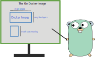

There are various ways to organize your Dockerfile and CI.

After having tried many solutions, I have a solid way to write your Dockerfile for your Go program.

The Dockerfile is also heavily optimized for the Docker layer caching mechanism, to have fast rebuilds locally and on your CI.

In this post, we will analyze such Dockerfile and analyze the structure of it, which is optimized for caching, secured and designed to contain everything.

## The Dockerfile

```Dockerfile
ARG BUILDPLATFORM=linux/amd64

ARG ALPINE_VERSION=3.13
ARG GO_VERSION=1.16

FROM --platform=$BUILDPLATFORM qmcgaw/xcputranslate:v0.6.0 AS xcputranslate

FROM --platform=$BUILDPLATFORM golang:${GO_VERSION}-alpine${ALPINE_VERSION} AS base
RUN apk --update add git g++
ENV CGO_ENABLED=0
ARG GOLANGCI_LINT_VERSION=v1.40.1
RUN go get github.com/golangci/golangci-lint/cmd/golangci-lint@${GOLANGCI_LINT_VERSION} 2>&1
COPY --from=xcputranslate /xcputranslate /usr/local/bin/xcputranslate
WORKDIR /tmp/build
COPY go.mod go.sum ./
RUN go mod download
COPY cmd/ ./cmd/
COPY internal/ ./internal/
COPY pkg/ ./pkg/

FROM base AS lint
COPY .golangci.yml ./
RUN golangci-lint run --timeout=10m

FROM base AS test
ENV CGO_ENABLED=1

FROM base AS tidy
RUN git init && \
    git config user.email ci@localhost && \
    git config user.name ci && \
    git add -A && git commit -m ci && \
    sed -i '/\/\/ indirect/d' go.mod && \
    go mod tidy && \
    git diff --exit-code -- go.mod

FROM base AS build
ARG VERSION=unknown
ARG BUILD_DATE="an unknown date"
ARG COMMIT=unknown
ARG TARGETPLATFORM
RUN GOARCH="$(xcputranslate translate -targetplatform=${TARGETPLATFORM} -field arch)" \
    GOARM="$(xcputranslate translate -targetplatform=${TARGETPLATFORM} -field arm)" \
    go build -trimpath -ldflags="-s -w \
    -X 'main.version=$VERSION' \
    -X 'main.buildDate=$BUILD_DATE' \
    -X 'main.commit=$COMMIT' \
    " -o app cmd/app/main.go

FROM --platform=$BUILDPLATFORM alpine:${ALPINE_VERSION} AS alpine
RUN apk --update add ca-certificates tzdata

FROM scratch
USER 1000
COPY --from=alpine --chown=1000 /etc/ssl/certs/ca-certificates.crt /etc/ssl/certs/
COPY --from=alpine --chown=1000 /usr/share/zoneinfo /usr/share/zoneinfo
ENTRYPOINT ["/app"]
EXPOSE 8000/tcp 8001/tcp
HEALTHCHECK --interval=10s --timeout=5s --start-period=5s --retries=2 CMD ["/app","healthcheck"]
ENV HEALTHCHECK_SERVER_ADDRESS=127.0.0.1:9999 \
    API_TOKEN= \
    TZ=America/Montreal
ARG VERSION=unknown
ARG BUILD_DATE="an unknown date"
ARG COMMIT=unknown
LABEL \
    org.opencontainers.image.authors="quentin.mcgaw@gmail.com" \
    org.opencontainers.image.version=$VERSION \
    org.opencontainers.image.created=$BUILD_DATE \
    org.opencontainers.image.revision=$COMMIT \
    org.opencontainers.image.url="https://github.com/user/repo" \
    org.opencontainers.image.documentation="https://github.com/user/repo/blob/main/README.md" \
    org.opencontainers.image.source="https://github.com/user/repo" \
    org.opencontainers.image.title="title" \
    org.opencontainers.image.description="description"
COPY --from=build --chown=1000 /tmp/build/app /app
```

## The `base` stage

The base stage consists in setting up the Go environment with our code and dependencies such that it can be used by other stages downstream.

```Dockerfile
FROM --platform=$BUILDPLATFORM golang:${GO_VERSION}-alpine${ALPINE_VERSION} AS base
RUN apk --update add git g++
ENV CGO_ENABLED=0
ARG GOLANGCI_LINT_VERSION=v1.40.1
RUN go get github.com/golangci/golangci-lint/cmd/golangci-lint@${GOLANGCI_LINT_VERSION} 2>&1
COPY --from=xcputranslate /xcputranslate /usr/local/bin/xcputranslate
WORKDIR /tmp/build
COPY go.mod go.sum ./
RUN go mod download
COPY cmd/ ./cmd/
COPY internal/ ./internal/
COPY pkg/ ./pkg/
```

1. We start from the official Golang Alpine image because it's smaller. Note we use `--platform=$BUILDPLATFORM` so that we build using the native platform. We can still cross build though, as you will see later.
1. We install `git` which is needed for `go mod` operations.
1. We install `g++` for running the [Go race detector](https://blog.golang.org/race-detector) in our tests (see the [`test` stage](#The-`test`-stage)).
1. 🚨 We set `ENV CGO_ENABLED=0` to build static binaries and not musl dynamically linked binaries! Sadly, a lot of developers are not aware of this important detail.
1. We install `golangci-lint` which will be used in the `lint` stage downstream.
1. We install `xcpustranslate` from `qmcgaw/xcputranslate:v0.6.0` aliased as `xcputranslate` ([why we do this](../buildkit-cross-arch-bug)) which will be used in the `build` stage downstream.
1. Since we are modern humans and use Go modules in our project, we use `/tmp/build` as our working directory.
1. We copy `go.mod` and `go.sum` only first, in order to download the Go dependencies. Since these two files should change way less than the rest of the Go codebase, this has the advantage of not having to re-install dependencies every time some code is changed, thanks to Docker's layer caching mechanism.
1. We finally copy the rest of our code, which should reside in the directories `cmd`, `internal` and `pkg` if you follow a clean Go project structure.

## The `lint` stage

The `lint` stage is:

```Dockerfile
FROM base AS lint
COPY .golangci.yml ./
RUN golangci-lint run --timeout=10m
```

Assuming you use [golangci-lint](https://github.com/golangci/golangci-lint) as your linter, you should definitely also use a configuration file `.golangci.yml`.

This simply copies your configuration file and runs the linters against your code.

You can run it with `docker build --target lint .` in your CI for example.

## The `test` stage

The `test` stage is:

```Dockerfile
FROM base AS test
ENV CGO_ENABLED=1
```

Pretty simple. We set `ENV CGO_ENABLED=1` this time to be able to run the [Go race detector](https://blog.golang.org/race-detector).

This allows to run parallel tests and detect data races. It is slower than simple `go test ./...` but well worth the additional time.

Now, as you can see the stage stops here without running any test.

This is because it's really cumbersome to run side containers such as a test database when building a Docker image.
And because we usually like to collect test information such as coverage altogether, it's best to run Go unit and integration tests only in your CI.
However, the CI should run tests using the image built with that `test` stage for consistency.

For example, for Github Actions, that would be:

```yml
jobs:
  verify:
    runs-on: ubuntu-latest
    env:
      DOCKER_BUILDKIT: "1"
    steps:
      - uses: actions/checkout@v2

      # ...

      - name: Build test image
        run: docker build --target test -t test-container .

      - name: Run tests in test container
        run: |
          touch coverage.txt
          docker run --rm \
          -v "$(pwd)/coverage.txt:/tmp/build/coverage.txt" \
          test-container \
          go test \
          -race \
          -coverpkg=./... \
          -coverprofile=coverage.txt \
          -covermode=atomic \
          ./...

        # ...
```

As you can see, we run the tests with

```sh
go test -race -coverpkg=./... -coverprofile=coverage.txt -covermode=atomic ./...
```

The coverage is written to `coverage.txt` that we just created and bind mounted.
We can later process that coverage file in another step, for example report it to a third party service.

Now this example does not include a test database, but it is relatively easy to add it as a service to the Github Actions job
and run tests against it, provided the container is running in the same Docker network as the database container.

You may also need to add a build tag such as `-tags=psql` to your `go test` command, if you have such tags in your Postresql database integration tests for example.

## The `tidy` stage

The `tidy` stage is:

```Dockerfile
FROM base AS tidy
RUN git init && \
    git config user.email ci@localhost && \
    git config user.name ci && \
    git add -A && git commit -m ci && \
    sed -i '/\/\/ indirect/d' go.mod && \
    go mod tidy && \
    git diff --exit-code -- go.mod
```

🧐 Quite strange right?

This is the product of my frustration with unneeded indirect go.mod dependencies.

What it does is:

1. It initializes a git repo, since we don't copy `.git/` in our image: `git init`
1. It configures the Git user with a dummy email and name, since we are not going to push anything: `git config user.email ci@localhost && git config user.name ci`
1. It adds and commits all the files: `git add -A && git commit -m ci`
1. It removes all the dependencies from `go.mod` with a `// indirect` suffix: `sed -i '/\/\/ indirect/d' go.mod`
1. It runs `go mod tidy`, which should re-add `// indirect` dependencies if they are actually needed
1. It compares the git tree with the previous commit. If there is a difference it fails, meaning there is a useless dependency here.

I hope you enjoy the little hack.

## The `build` stage

Here comes the real business: the `build` stage.

```Dockerfile
FROM base AS build
ARG VERSION=unknown
ARG BUILD_DATE="an unknown date"
ARG COMMIT=unknown
ARG TARGETPLATFORM
RUN GOARCH="$(xcputranslate translate -targetplatform=${TARGETPLATFORM} -field arch)" \
    GOARM="$(xcputranslate translate -targetplatform=${TARGETPLATFORM} -field arm)" \
    go build -trimpath -ldflags="-s -w \
    -X 'main.version=$VERSION' \
    -X 'main.buildDate=$BUILD_DATE' \
    -X 'main.commit=$COMMIT' \
    " -o app cmd/app/main.go
```

We define 4 build arguments:

- `VERSION`, defaulting to `unknwon`, which should be set by the CI.
- `BUILD_DATE`, defaulting to `an unknown date`, which should be set by the CI.
- `COMMIT`, defaulting to `unknown`, which should be set by the CI.
- `TARGETPLATFORM` which is injected by `docker build` automatically, specifying the target platform such as `linux/amd64`.

The `RUN` command runs the `go build` command with a bunch of goodies.

The local variables `GOARCH` and `GOARM` are set using `xcputranslate`. `xcputranslate` translates for example from `linux/arm/v6` to `GOARCH=arm` and `GOARM=6`.

The `-trimpath` flag is set since we do not want to see `/tmp/build` in stack traces, as this is a temporary Docker build stage.

The `-ldflags` flag is set with multiple elements:

- `-s` TODO
- `-w` TODO
- `-X` flags to set version information in the program:
  - `-X 'main.version=$VERSION'`, assuming you have a global variable in your main package called `var version string`
  - `-X 'main.buildDate=$BUILD_DATE'`, assuming you have a global variable in your main package called `var buildDate string`
  - `-X 'main.commit=$COMMIT'`, assuming you have a global variable in your main package called `var commit string`

Finally the output flag `-o app` is set so the binary is written to `./app` to avoid any naming or path surprises.

## The `alpine` stage

That stage is a bit of a strange one.

```Dockerfile
FROM --platform=$BUILDPLATFORM alpine:${ALPINE_VERSION} AS alpine
RUN apk --update add ca-certificates tzdata
```

It's only used to download some files we might need in our program, such as:

- CA certificates (for TLS/HTTPs)
- Timezone data to have timezone-d log times for example, and using the `TZ` environment variable at runtime

We can run on the native platform `BUILDPLATFORM` since those files are the same for all architectures.

## The final image

The final image stage is optimized for Docker layer caching, so, although it might not make sense to human eyes that much,
it make sense for blazing fast rebuilds.

```Dockerfile
FROM scratch
USER 1000
COPY --from=alpine --chown=1000 /etc/ssl/certs/ca-certificates.crt /etc/ssl/certs/
COPY --from=alpine --chown=1000 /usr/share/zoneinfo /usr/share/zoneinfo
ENTRYPOINT ["/app"]
EXPOSE 8000/tcp 8001/tcp
HEALTHCHECK --interval=10s --timeout=5s --start-period=5s --retries=2 CMD ["/app","healthcheck"]
ENV HEALTHCHECK_SERVER_ADDRESS=127.0.0.1:9999 \
    API_TOKEN= \
    TZ=America/Montreal
ARG VERSION=unknown
ARG BUILD_DATE="an unknown date"
ARG COMMIT=unknown
LABEL \
    org.opencontainers.image.authors="quentin.mcgaw@gmail.com" \
    org.opencontainers.image.version=$VERSION \
    org.opencontainers.image.created=$BUILD_DATE \
    org.opencontainers.image.revision=$COMMIT \
    org.opencontainers.image.url="https://github.com/user/repo" \
    org.opencontainers.image.documentation="https://github.com/user/repo/blob/main/README.md" \
    org.opencontainers.image.source="https://github.com/user/repo" \
    org.opencontainers.image.title="title" \
    org.opencontainers.image.description="description"
COPY --from=build --chown=1000 /tmp/build/app /app
```

We will decompose each aspect of the Dockerfile in the following subsections.

### [`scratch`](https://hub.docker.com/_/scratch) base image

We use [`scratch`](https://hub.docker.com/_/scratch) as the base of our final image.

`scratch` is a great choice for Go applications since these are statically built.

It also comes with *nothing*, adding some extra security.
For example [`alpine`](https://hub.docker.com/_/alpine) is quite secured as it's minimal, but `debian` images always have CVEs unfortunately.
You can use an Alpine base image if you really want to have a shell you can exec with, but that is (**trigger warning**) usually not necessary.

### Run without root

The first instruction is to run as user ID `1000`:

```Dockerfile
USER 1000
```

By default, the image would otherwise run as root (user ID `0`).

This should never really change, which is good for caching purposes.

### Files that do not change much

We start by copying from the `alpine` stage the CA certificates and the timezone information, since `scratch` does not have any file.

```Dockerfile
COPY --from=alpine --chown=1000 /etc/ssl/certs/ca-certificates.crt /etc/ssl/certs/
COPY --from=alpine --chown=1000 /usr/share/zoneinfo /usr/share/zoneinfo
```

We have these instructions at the top since these rarely change, so caching can be used quite a lot.

Note that we have the flag `--chown=1000` such that these files are owned by user with ID `1000` that we use.
Alternatively, you could also run `chown 1000` on these files in the `alpine` stage since ownership is carried between stages, up to you!

### Entrypoint

We define the entrypoint of the Docker image with

```Dockerfile
ENTRYPOINT ["/app"]
```

Note that you must use the `["/app"]` notation for it work on `scratch` based images. `ENTRYPOINT /app` will not work for example.

This instruction should not change much either once it's set.

### Expose ports

We then add the ports exposed by the Docker image with

```Dockerfile
EXPOSE 8000/tcp 8001/tcp
```

This has no other use than documentation.

The user will be able to see exposed ports when running `docker ps` for example.

This is not meant to change much, so we are again optimizing for the Docker caching.

### Healthcheck

We then define the Docker healthcheck:

```Dockerfile
HEALTHCHECK --interval=10s --timeout=5s --start-period=5s --retries=2 CMD ["/app","healthcheck"]
```

Note that this `HEALTHCHECK` instruction only executes on native Docker and Docker Swarm, not Kubernetes.
You would have to use this as documentation and adapt it in your Kubernetes healthcheck definition.

Since we run on `scratch`, the `app` Go program is built to run in *healthcheck mode*.

What it usually does is that it runs ephemerally as an HTTP client sending a request to the main `app` process, which returns if the application is healthy or not.
The main application usually has a healthcheck server listening on `127.0.0.1:9999`, which you might need to change to `:9999` if you use Kubernetes.
Depending on the reponse received, this ephemeral healthchecking mode app will exit with an exit code of `0` (success) or `1` (failure).
This mechanism adds a bit more coding to do, but is well worth it, even when not running on a `scratch` based image in my opinion.
That way your healthcheck no longer depends on a third party tool such as `wget` or `curl`.

This instruction should not change much either, once it's set up.

### Environment variables

We set some default environment variables with

```Dockerfile
ENV HEALTHCHECK_SERVER_ADDRESS=127.0.0.1:9999 \
    API_TOKEN= \
    TZ=America/Montreal
```

`HTTP_SERVER_ADDRESS` and `API_TOKEN` would be environment variables consumed by the Go program.
`TZ` is the timezone which is consumed by the Go `time` package automagically.

It's nice to define all your environment variables there, even with an empty value such as `API_TOKEN=`, for the end user documentation.
It will show the available variables for example if the user `docker inspect` the image.

These might change a bit with time, since we add environment variables and change defaults, so this is the point from which the caching is no longer that effective.

### Build arguments and labels

We define again the build arguments `VERSION`, `BUILD_DATE` and `COMMIT` but this time to write the build information to the Docker image labels.
The `LABEL` instruction contains all the OpenContainers image labels you might want to set.

Some of them such as `org.opencontainers.image.version` is dynamic and is assigned the build argument value of `VERSION`.

Because these are dependent on build arguments, these will change on every build, so caching is totally useless at this point.

### The binary

Finally, we copy over the binary, which should really be different for every build.

```Dockerfile
COPY --from=build --chown=1000 /tmp/build/app /app
```

Again we pass the `--chown=1000` flag so that it is owned by user ID `1000`.

## Conclusion

You should at this point know how to write an awesome Dockerfile! 🎈

It is heavily optimized for caching and rebuilds should be very fast, especially if you enable caching on your CI.

It also has decoupled stages, which can also run in parallel if you use buildkit.

Finally, it is designed to cross CPU build Docker images, you might be interested in the [Cross CPU Docker images using Go](../cross-cpu-docker-images-using-go) post.

Enjoy your `docker build`! 😊
