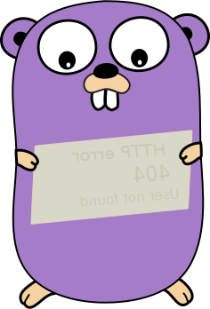

In a hurry 🏃? [**Jump to the conclusion**](#conclusion)



After some [discussion on Reddit](https://www.reddit.com/r/golang/comments/podfn9/error_handling_seems_to_be_a_recurring_theme_in/hd09b6o?utm_source=share&utm_medium=web2x&context=3),
I decided to write this blog post on how to have Go errors containing codes you can use in calling layers.

This is the case for example if you want to have the HTTP status code contained in an error created in your `database` package.

Let's start with some base code showing how this works.

You have two files:

1. `./database/db.go` with content

    ```go
    package database

    import (
        "errors"
        "net/http"
    )

    type HTTPError struct {
        message    string
        statusCode int
    }

    func (e HTTPError) Error() string {
        return e.message
    }

    func (e HTTPError) StatusCode() int {
        return e.statusCode
    }

    func GetUserNameFromID(ID string) (name string, err error) {
        return "", &HTTPError{
            message:    "user not found",
            statusCode: http.StatusNotFound,
        }
    }
    ```

2. `./server/handler.go` with an HTTP handler using the database function `GetUserNameFromID`:

    ```go
    package server

    import (
        "errors"
        "net/http"

        "yourpackage/database"
    )

    // ...

    func handlerUserIDToName(r *http.Request, w http.ResponseWriter) {
        id := r.URL.Query().Get("id")

        name, err := database.GetUserNameFromID(id)
        if err != nil {
            httpErr := new(HTTPError)
            switch {
            case errors.As(err, httpErr):
                http.Error(w, httpErr.Error(), httpErr.StatusCode())
            default: // not an HTTPError
                http.Error(w, err.Error(), http.StatusInternalServerError)
            }
        }

        w.Write([]byte(name)) // no error
    }
    ```

The key steps are to:

1. Define our own error implementation `HTTPError`
2. Use `errors.As(err, httpErr)`:

    ```go
    httpErr := new(HTTPError)
    if errors.As(err, httpErr) {
        // access httpErr extra methods on top of .Error()
    } else {
        // you can only access .Error()
    }
    ```

## Conclusion

1. You can define your own `error` interface implementation with as many fields and methods you want
1. You can convert that error back to its implementation in callers using `errors.As(err, targetErrImplementation)`
