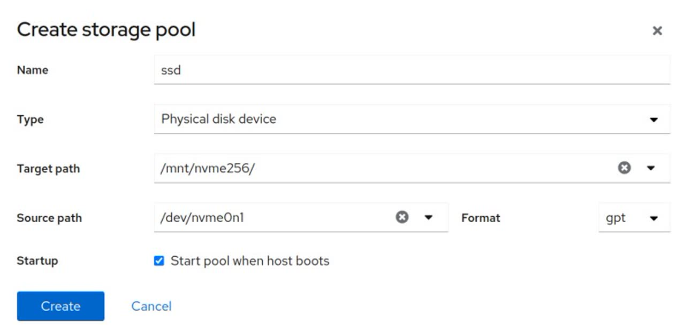
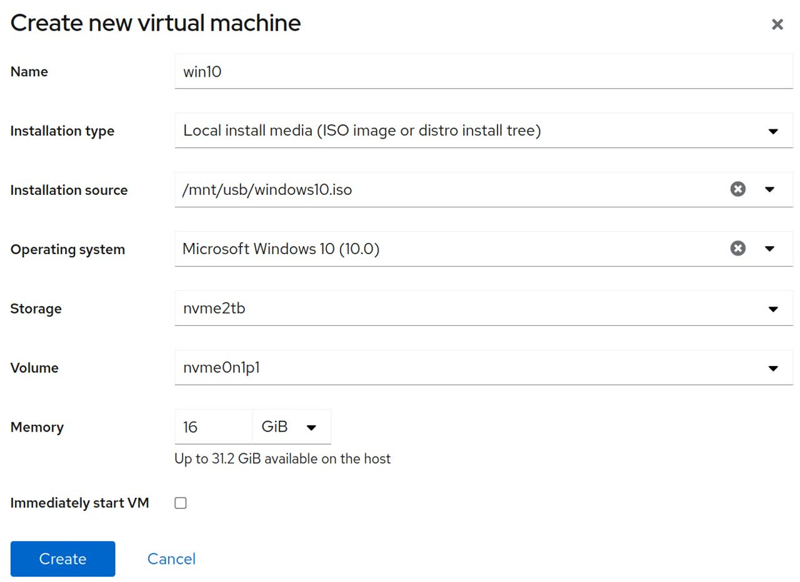
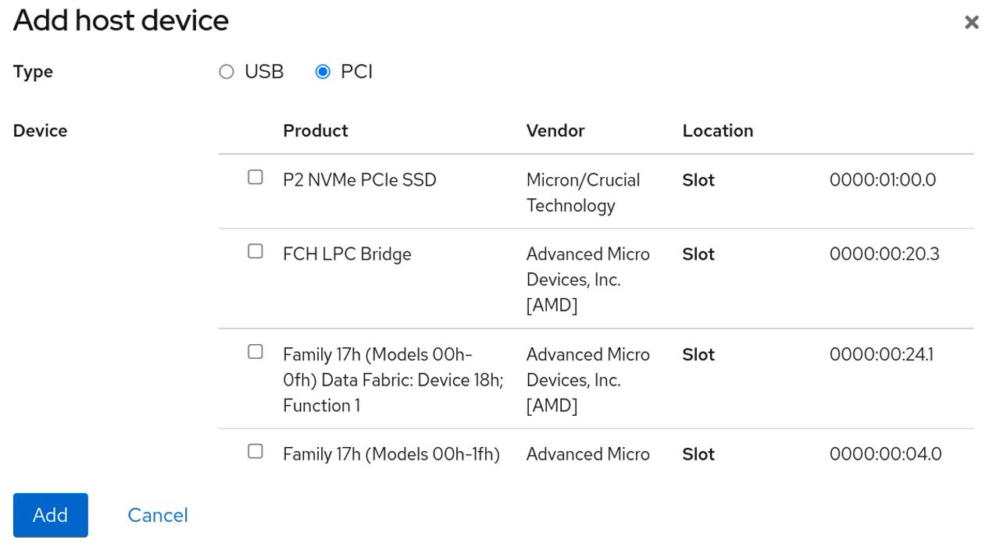

I have a custom built Arch Linux server running all the time, running mostly Docker containers.

In this guide we will approach two situations. The first one will be how to do the initial setup of the
Windows virtual machine with GPU passthrough. The second one will be how to change GPU and update the configuration.

**In both paths, there will be step by step instructions with precise commands and examples.**

## Part 1: initial setup

I wanted to setup a Windows 10 virtual machine with GPU passthrough such that:

- I don't have to run another Windows 10 machine to save on Hardware costs and electricity
- Friends without a gaming computer would be able to play on my server
- I could play on my server remotely (= no need to carry a mini ITX build at airports)
- It would be isolated from the rest of the server

For reference, my configuration is:

- Host OS: `Linux zenarch 5.14.16-arch1-1 #1 SMP PREEMPT Tue, 02 Nov 2021 22:22:59 +0000 x86_64 GNU/Linux` (post updated from kernel `5.7.7`, 2020-07-01)
- CPU: AMD Ryzen 2600x
- Motherboard: ASUS Strix X470-I
- GPU: MSI GTX 1660 Super
- RAM: 32GB

### Pre-requisites

- A motherboard supporting UEFI (most modern motherboards do)
- A graphics card VBIOS supporting UEFI (most modern cards do)
- Access your server through SSH
- Run as `root`, no time to waste `sudo`ing everything

### Motherboard UEFI configuration

- Virtualization enabled (a.k.a. *VT-d* or *AMD-v* or *SVM mode*)
- IOMMU enabled (for me, it was in *Advanced/AMD CBS/NBIO Common Options/NB Configuration*)
- Any kind of CSM **completely disabled**

### Bootloader and IOMMU

The following is for GRUB, although similar instructions should apply to
systemd-boot (i.e. add `amd_iommu=on iommu=pt` to the `options` line in your
boot entry file).

1. Modify `/etc/default/grub` changing:

    ```sh
    GRUB_CMDLINE_LINUX_DEFAULT="loglevel=3 quiet"
    ```

    to

    ```sh
    GRUB_CMDLINE_LINUX_DEFAULT="loglevel=3 quiet amd_iommu=on iommu=pt video=efifb:off"
    ```

   **If you have an Intel CPU**, use `intel_iommu` instead of `amd_iommu`.

1. Rebuild the Grub config

    ```sh
    grub-mkconfig -o /boot/grub/grub.cfg
    ```

1. Reboot

    ```sh
    poweroff --reboot
    ```

1. Check the Linux kernel ring buffer

      ```sh
      dmesg | grep -i -e DMAR -e IOMMU
      ```

    You should see something similar to:

    ```log
    [    0.000000] Command line: BOOT_IMAGE=/boot/vmlinuz-linux root=UUID=d086663a-xxxxx-xxx rw loglevel=3 quiet amd_iommu=on iommu=pt
    [    0.000000] Kernel command line: BOOT_IMAGE=/boot/vmlinuz-linux root=UUID=d086663a-xxxx-xxx rw loglevel=3 quiet amd
    iommu=on iommu=pt
    [    0.173349] iommu: Default domain type: Passthrough (set via kernel command line)
    [    0.282985] pci 0000:00:00.2: AMD-Vi: IOMMU performance counters supported
    [    0.283054] pci 0000:00:01.0: Adding to iommu group 0
    [    0.283071] pci 0000:00:01.1: Adding to iommu group 1
    [    0.283086] pci 0000:00:01.3: Adding to iommu group 2
    ...
    ...
    ...
    [    0.283703] pci 0000:0a:00.3: Adding to iommu group 21
    [    0.283938] pci 0000:00:00.2: AMD-Vi: Found IOMMU cap 0x40
    [    0.284262] perf/amd_iommu: Detected AMD IOMMU #0 (2 banks, 4 counters/bank).
    [    0.292351] AMD-Vi: AMD IOMMUv2 driver by Joerg Roedel <jroedel@suse.de>
    ```

### Find your IOMMU group

Find the group your GPU belongs to.

1. Save a file `script.sh` with content

    ```sh
    #!/bin/bash
    shopt -s nullglob
    for g in /sys/kernel/iommu_groups/*; do
        echo "IOMMU Group ${g##*/}:"
        for d in $g/devices/*; do
            echo -e "\t$(lspci -nns ${d##*/})"
        done;
    done;
    ```

1. Run it

    ```sh
    chmod +x script.sh
    ./script.sh
    ```

1. You should obtain something similar to

    ```log
    IOMMU Group 0:
            00:01.0 Host bridge [0600]: Advanced Micro Devices, Inc. [AMD] Family 17h (Models 00h-1fh) PCIe Dummy Host Bridge [1022:1452]
    ...
    ...
    ...
    IOMMU Group 15:
            08:00.0 VGA compatible controller [0300]: NVIDIA Corporation TU116 [GeForce GTX 1660 SUPER] [10de:21c4] (rev a1)
            08:00.1 Audio device [0403]: NVIDIA Corporation TU116 High Definition Audio Controller [10de:1aeb] (rev a1)
            08:00.2 USB controller [0c03]: NVIDIA Corporation Device [10de:1aec] (rev a1)
            08:00.3 Serial bus controller [0c80]: NVIDIA Corporation TU116 [GeForce GTX 1650 SUPER] [10de:1aed] (rev a1)
    ...
    ...
    ...
    IOMMU Group 9:
            00:08.0 Host bridge [0600]: Advanced Micro Devices, Inc. [AMD] Family 17h (Models 00h-1fh) PCIe Dummy Host Bridge [1022:1452]
    ```

    Here the group we want is group `15`. If you have something unusual, see [this](https://wiki.archlinux.org/index.php/PCI_passthrough_via_OVMF#Gotchas).

### Binding devices to VFIO-PCI

We need to bind all devices of the IOMMU Group `15` to the VFIO PCI driver at boot.

1. Edit `/etc/default/grub` changing:

    ```sh
    GRUB_CMDLINE_LINUX_DEFAULT="loglevel=3 quiet amd_iommu=on iommu=pt video=efifb:off"
    ```

    to (replacing the IDs from device IDs you obtained above)

    ```sh
    GRUB_CMDLINE_LINUX_DEFAULT="loglevel=3 quiet amd_iommu=on iommu=pt video=efifb:off vfio-pci.ids=10de:21c4,10de:1aeb,10de:1aec,10de:1aed"
    ```

1. Rebuild the Grub config

    ```sh
    grub-mkconfig -o /boot/grub/grub.cfg
    ```

### Kernel modules

1. Modify `/etc/mkinitcpio.conf` and add `vfio_pci vfio vfio_iommu_type1 vfio_virqfd` to your `MODULES` array.

    For example, change from

    ```sh
    MODULES=()
    ```

    to

    ```sh
    MODULES=(vfio_pci vfio vfio_iommu_type1 vfio_virqfd)
    ```

1. Regenerate the initramfs with

    ```sh
    mkinitcpio -p linux
    ```

### Reboot and check

1. Reboot

    ```sh
    poweroff --reboot
    ```

1. Check the VFIO kernel module got loaded:

    ```sh
    dmesg | grep -i vfio
    ```

   Should output

    ```log
    [    0.000000] Command line: BOOT_IMAGE=/boot/vmlinuz-linux root=UUID=d086663a-9179-48c6-9946-1035da860829 rw loglevel=3 quiet amd_iommu=on iommu=pt vfio-pci.ids=10de:21c4,10de:1aeb,10de:1aec,10de:1aed
    [    0.000000] Kernel command line: BOOT_IMAGE=/boot/vmlinuz-linux root=UUID=d086663a-9179-48c6-9946-1035da860829 rw loglevel=3 quiet amd_iommu=on iommu=pt vfio-pci.ids=10de:21c4,10de:1aeb,10de:1aec,10de:1aed
    [    3.396953] VFIO - User Level meta-driver version: 0.3
    [    3.400366] vfio-pci 0000:09:00.0: vgaarb: changed VGA decodes: olddecodes=io+mem,decodes=io+mem:owns=io+mem
    [    3.416692] vfio_pci: add [10de:21c4[ffffffff:ffffffff]] class 0x000000/00000000
    [    3.433353] vfio_pci: add [10de:1aeb[ffffffff:ffffffff]] class 0x000000/00000000
    [    3.450019] vfio_pci: add [10de:1aec[ffffffff:ffffffff]] class 0x000000/00000000
    [    3.466953] vfio_pci: add [10de:1aed[ffffffff:ffffffff]] class 0x000000/00000000
    ```

    You can check for example that the device ID `10de:21c4` got added with:

    ```sh
    lspci -nnk -d 10de:21c4
    ```

    Showing

    ```log
    09:00.0 VGA compatible controller [0300]: NVIDIA Corporation TU116 [GeForce GTX 1660 SUPER] [10de:21c4] (rev a1)
            Subsystem: Micro-Star International Co., Ltd. [MSI] Device [1462:c75a]
            Kernel driver in use: vfio-pci
            Kernel modules: nouveau
    ```

### Virtual machine requirements

1. Install necessary packages

    ```sh
    pacman -Sy --no-confirm qemu libvirt virt-install edk2-ovmf dnsmasq
    ```

    - `qemu` is the  machine emulator and virtualizer
    - `libvirt` is a wrapper around `qemu` so we can use a user interface to configure the virtual machine
    - `virt-install` is needed to install the VM using the cockpit web user interface
    - `edk2-ovmf` so the virtual machine can run an UEFI firmware
    - `dnsmasq` is needed to configure the network for the virtual machine

1. Enable and start the libvirtd service and its logging component virtlogd.socket

    ```sh
    systemctl enable --now libvirtd
    systemctl enable --now virtlogd.socket
    ```

1. Activate the default virtual network

    ```sh
    virsh net-start default
    ```

### Virtual machine management GUI

We will setup the Cockpit Web user interface (by RedHat), which is quite better than the older `virt-manager`.

1. Install required packages

    ```sh
    pacman -S cockpit cockpit-machines udisks2-qt5 packagekit
    ```

1. Enable and run the cockpit service

    ```sh
    systemctl enable --now cockpit.socket
    ```

1. Assuming your server is at `192.168.1.2`, access it at [https://192.168.1.2:9090](https://192.168.1.2:9090) and login using your system credentials, ideally with `root`.

### Download the Windows 10 iso

1. Go to [https://www.microsoft.com/en-us/software-download/windows10ISO](https://www.microsoft.com/en-us/software-download/windows10ISO)
1. Select the Windows 10 edition, language and architecture you want to download the iso file.
1. Rename it to `Windows10.iso` and place it somewhere on your server.

### Virtual machine configuration

#### Creating the virtual machine

For storage, you can either use a disk image which you can store anywhere you want or use a full disk or partition.

If you want to use a disk, create a storage pool [https://192.168.1.2:9090/machines#/storages](https://192.168.1.2:9090/machines#/storages)
using the disk, and then create a volume with format `none`.



Click on the created storage pool and click on **Activate**.

Head to the machine Cockpit web UI at [https://192.168.1.2:9090/machines](https://192.168.1.2:9090/machines) and click on **Create VM** on the right hand side. Set the fields similarly to the below screenshot:



Then click on the VM name, here it's `win10`, to show a more detailed menu. This should be at [https://192.168.1.2:9090/machines#vm?name=win10](https://192.168.1.2:9090/machines#vm?name=win10).

- Edit the number of vCPUs from `2` to another number if you want. Ideally set the same amount of threads per core your CPU has physically (usually 2 per core).
- Edit the CPU type to `host-passthrough`
- Edit the firmware from `BIOS` to `UEFI`
- Change the boot order to have the `cdrom` of your ISO before the disk. I personally I had the bug I had to click Install, then force shut down in order for the disc drive to appear in the boot order.

    

Click on **Install** at the top.

A VNC console screen will appear on the right hand side, click on it and press a key to boot from the ISO file.

You can then follow Windows installation steps interactively.

#### VFIO Windows setup

Once you are done setting up Windows 10, in the virtual machine:

1. Download the [Virtio drivers for Windows 10](https://fedorapeople.org/groups/virt/virtio-win/direct-downloads/archive-virtio/virtio-win-0.1.208-1/virtio-win-gt-x64.msi) and install it.
1. Download the Nvidia/AMD drivers for your graphics card but **do not** install it yet.
1. Download and install [Parsec](https://parsecgaming.com/) as a machine level installation.
1. Log in to your Parsec account.
1. **Configure Parsec to start with Windows** 
1. Shut down the virtual machine.

#### Hide the VM

We will edit the Windows 10 libvirt xml file to hide away we are running in a virtual machine so graphics drivers won't detect that we are running in a virtual machine.

Open your editor with

```sh
virsh edit win10
```

All the following modifications have to be done in the block

```xml
<features>
  ...
</features>
```

1. Add the following in the `<features>` XML block

    ```xml
    <ioapic driver='kvm'/>
    ```

1. Add the following in the `<features>` XML block

    ```xml
    <kvm>
      <hidden state='on'/>
    </kvm>
    ```

1. Make the Hyperv vendor ID random, by adding to the `<hyperv>` XML block:

    ```xml
    <vendor_id state='on' value='123412341234'/>
    ```

#### Add the Graphics card

1. Go to the cockpit web UI at [https://192.168.1.2:9090](https://192.168.1.2:9090)
1. Click on the virtual machine *win10* [https://192.168.1.2:9090/machines#vm?name=win10](https://192.168.1.2:9090/machines#vm?name=win10)
1. Click on the **Add host device** button in the *Host devices* section
1. Select **PCI** and tick all the devices related to the graphics card. It should be trivial to spot all devices of NVIDIA corporation for example. If you want to ensure these are the right ones, compare their hardware ID on the rightmost column with the ones you got earlier in the IOMMU group.

    

1. Click **Add**
1. Start the virtual machine
1. Using the VNC console, install the Nvidia/AMD drivers now
1. Shut down the virtual machine ⏹️

#### Remove unneeded devices

In the Cockpit web UI virtual machine settings, you can now remove the `cdrom` 'Disk'.

You can also connect to the VM using Parsec and disable the primary second display used by the VNC viewer.

### Final steps

1. Boot the virtual machine
1. Install Parsec on your client device, log in and connect to your virtual machine
1. Profit 🎉 🎆 🎉

## Part 2: upgrade your graphics card

Fortunately for me, I managed to buy an RTX 3070 in those dark times of early 2021.

I thus decided to upgrade my GTX 1660 Super to my RTX 3070 so I could play in 1440p better or even in 4k 30fps
if the bandwidth allows it, such as inside my LAN in my living room.

We assume you have **the same prequisites and configuration** from [Part 1](#part-1:-initial-setup)

### Cleanup

#### Windows 10 VM

1. Log in to your Cockpit web UI at [https://192.168.1.2:9090](https://192.168.1.2:9090)
1. Shutdown the Windows 10 virtual machine
1. Click on *win10* and head to the **Host devices** section.
1. Remove each of the host PCI devices of the card you want to remove. In my case I had to click on *Remove* for each of these:
    - `PCI 0000:08:00.0`
    - `PCI 0000:08:00.1`
    - `PCI 0000:08:00.2`
    - `PCI 0000:08:00.3`
1. Remove the PCI VFIO device bindings
    1. Edit `/etc/default/grub` changing:

        ```sh
        GRUB_CMDLINE_LINUX_DEFAULT="loglevel=3 quiet amd_iommu=on iommu=pt video=efifb:off vfio-pci.ids=10de:21c4,10de:1aeb,10de:1aec,10de:1aed"
        ```

        back to

        ```sh
        GRUB_CMDLINE_LINUX_DEFAULT="loglevel=3 quiet amd_iommu=on iommu=pt video=efifb:off"
        ```

    1. Rebuild the Grub config

        ```sh
        grub-mkconfig -o /boot/grub/grub.cfg
        ```

1. Power off the machine

    ```sh
    poweroff
    ```

### Changing the graphics card

Simply (or not) change the graphics card.

In my case, I changed it from an MSI GTX 1660 Super to an MSI RTX 3070 2X Ventus OC.

Finally, boot the computer.

### Find the new IOMMU group

Find the group your new GPU belongs to.

1. Save a file `script.sh` with content

    ```sh
    #!/bin/bash
    shopt -s nullglob
    for g in /sys/kernel/iommu_groups/*; do
        echo "IOMMU Group ${g##*/}:"
        for d in $g/devices/*; do
            echo -e "\t$(lspci -nns ${d##*/})"
        done;
    done;
    ```
It should be trivial to spot all devices of NVIDIA corporation for example. 
1. Run it

    ```sh
    chmod +x script.sh
    ./script.sh
    ```

1. You should obtain something similar to

    ```log
    IOMMU Group 0:
            00:01.0 Host bridge [0600]: Advanced Micro Devices, Inc. [AMD] Family 17h (Models 00h-1fh) PCIe Dummy Host Bridge [1022:1452]
    ...
    ...
    ...
    IOMMU Group 16:
            08:00.0 VGA compatible controller [0300]: NVIDIA Corporation Device [10de:2484] (rev a1)
            08:00.1 Audio device [0403]: NVIDIA Corporation Device [10de:228b] (rev a1)
    ...
    ...
    ...
    IOMMU Group 9:
            00:08.0 Host bridge [0600]: Advanced Micro Devices, Inc. [AMD] Family 17h (Models 00h-1fh) PCIe Dummy Host Bridge [1022:1452]
    ```

    This time the group we want is group `16`. If you have something unusual, see [this](https://wiki.archlinux.org/index.php/PCI_passthrough_via_OVMF#Gotchas).

### Re-binding devices to VFIO-PCI

We need to bind all devices of the IOMMU Group `16` to the VFIO PCI driver at boot.

1. Edit `/etc/default/grub` changing:

    ```sh
    GRUB_CMDLINE_LINUX_DEFAULT="loglevel=3 quiet amd_iommu=on iommu=pt video=efifb:off"
    ```

    to (replacing the IDs from device IDs you obtained above)

    ```sh
    GRUB_CMDLINE_LINUX_DEFAULT="loglevel=3 quiet amd_iommu=on iommu=pt video=efifb:off vfio-pci.ids=10de:2484,10de:228b"
    ```

1. Rebuild the Grub config

    ```sh
    grub-mkconfig -o /boot/grub/grub.cfg
    ```

### Reboot and check the new VFIO PCI ids are mentioned

1. Reboot

    ```sh
    poweroff --reboot
    ```

1. Reconnect with SSH and check the VFIO kernel module got loaded:

    ```sh
    dmesg | grep -i vfio
    ```

   Should output

    ```log
    [    0.000000] Command line: BOOT_IMAGE=/boot/vmlinuz-linux root=UUID=d086663a-9179-48c6-9946-1035da860829 rw loglevel=3 quiet amd_iommu=on iommu=pt video=efifb:off vfio-pci.ids=10de:2484,10de:228b
    [    0.000000] Kernel command line: BOOT_IMAGE=/boot/vmlinuz-linux root=UUID=d086663a-9179-48c6-9946-1035da860829 rw loglevel=3 quiet amd_iommu=on iommu=pt video=efifb:off vfio-pci.ids=10de:2484,10de:228b
    [    3.395726] VFIO - User Level meta-driver version: 0.3
    [    3.399043] vfio-pci 0000:08:00.0: vgaarb: changed VGA decodes: olddecodes=io+mem,decodes=io+mem:owns=none
    [    3.413368] vfio_pci: add [10de:2484[ffffffff:ffffffff]] class 0x000000/00000000
    [    3.430080] vfio_pci: add [10de:228b[ffffffff:ffffffff]] class 0x000000/00000000
    ```

    You can check for example that the device ID `10de:2484` got added with:

    ```sh
    lspci -nnk -d 10de:2484
    ```

    Showing

    ```log
    08:00.0 VGA compatible controller [0300]: NVIDIA Corporation Device [10de:2484] (rev a1)
            Subsystem: Micro-Star International Co., Ltd. [MSI] Device [1462:3909]
            Kernel driver in use: vfio-pci
            Kernel modules: nouveau
    ```

### Modify the virtual machine definitions

1. Go to the cockpit web UI at [https://192.168.1.2:9090](https://192.168.1.2:9090)
1. Click on the virtual machine *win10* [https://192.168.1.2:9090/machines#vm?name=win10](https://192.168.1.2:9090/machines#vm?name=win10)
1. Click on the **Add host device** button in the *Host devices* section
1. Select **PCI** and tick all the devices related to the graphics card you want to add. If you want to ensure these are the right ones, compare their hardware ID on the rightmost column with the ones you got earlier in the IOMMU group.
1. Start the virtual machine ⏯️
1. You can now connect to it using Parsec as before, and... profit again! 🎉 🎆 🎉

## References

- [Arch Linux Wiki on PCI Passthrough via OVMF](https://wiki.archlinux.org/index.php/PCI_passthrough_via_OVMF)
- [blog.zerosector.io article on KVM QEMU Windows 10 GPU Passthrough](https://blog.zerosector.io/2018/07/28/kvm-qemu-windows-10-gpu-passthrough/)
- [Vanities' Github on GPU passthrough Arch Linux to Windows 10](https://github.com/vanities/GPU-Passthrough-Arch-Linux-to-Windows10)

## Further work

Automate the setup with `virsh` to avoid relying on the Cockpit web UI. For example:

```sh
virt-install -n gaming \
  --description "Gaming VM with VFIO" \
  --os-type=Windows \
  --os-variant= \
  --ram=8096 \
  --vcpus=4 \
  --disk path=/var/lib/libvirt/images/myRHELVM1.img,bus=virtio,size=250 \
  --cdrom=.iso \
  --dry-run
  ...
```
