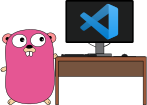

In April 2019, VSCode released a new extension [*Remote Containers Development*](https://code.visualstudio.com/docs/remote/containers) allowing you to code with your development environment in a Docker container. After having struggled somehow to install all the proper tooling for Go on my host, that looked like the perfect occasion to jump in.
That is why I developed the Docker image [`qmcgaw/godevcontainer`](https://github.com/qdm12/godevcontainer/) together with [devtainr](https://github.com/qdm12/devtainr) to have a blazing fast installation.

The following diagram will explain the remote container development concept much better than I can ever explain it:

(Credits to the VSCode team)

### `qmcgaw/godevcontainer`

Since Visual Studio Code 1.38 release in August 2019, Alpine based development containers are now supported.

Therefore the Docker image `qmcgaw/godevcontainer` is based on Alpine (`3.13` at the time of this writing).

The Dockerfile used to build it is available [**here**](https://github.com/qdm12/godevcontainer/blob/master/alpine.Dockerfile).

Some key features are:

- Minimal size of 881MB (uncompressed amd64 size)
- Based on [`qmcgaw/basedevcontainer`](https://github.com/qdm12/basedevcontainer/), itself based on Alpine 3.13
- Minimal custom `zsh` terminal with `oh-my-zsh`
- Using Go 1.16
- All the Go tooling binaries built statically from source: `gopls`, `guru`, `dlv`, `gorename`, etc.
- Configured to use Google's Go language server `gopls`
- Configured to use `golangci-lint` as its linter, which bundles several linters together
- Terminal Go tools: `mockgen`, `mockery`
- Built to work on all platforms: linux, osx and windows
- Easily bind mount your SSH keys to use with `git`
- Manage your host Docker from within the container using `docker` and `docker compose`
- Extra binary tools: `kubectl`, `kubectx`, `kubens`, `stern` and `helm`

## Setup

### Prerequisites

- [Docker](https://www.docker.com/products/docker-desktop)
  - If you use OSX or Windows without WSL, share the directories `~/.ssh`, `~/.docker`, `~/.kube` and the directory of your project with Docker Desktop
- [Docker Compose](https://docs.docker.com/compose/install/)
- [VS code](https://code.visualstudio.com/download)
- [VS code remote containers extension](https://marketplace.visualstudio.com/items?itemName=ms-vscode-remote.remote-containers)

### `devtainr`

[`devtainr`](https://github.com/qdm12/devtainr#Usage) was designed with the sole purpose of setting up development container configuration files in a ⚡!

It should not take you more than 30 seconds to download, run and be ready.

Note that you can also use for other development containers I have developed using `-dev rust` for example.

### `.devcontainer` directory

The following files should be in your `.devcontainer` directory:

- `.dockerignore` is here to make rebuilds faster eventually
- `Dockerfile` contains a simple `FROM qmcgaw/godevcontainer` which you can extend.
- `README.md` explains what the development container is and how to customize it.
- `devcontainer.json` contains the VSCode settings for the container, including `gopls` and linting configurations.
- `docker-compose.yml` contains the development container but can be extended to contain other services such as a development database

You can check out `.devcontainer/README.md` to learn how to customize it.

### Final step

Open the command palette in Visual Studio Code (CTRL+SHIFT+P) and select `Remote-Containers: Open Folder in Container...` and choose your project directory.

Done! 🌟

Enjoy the reproducible development environment!

### Additional notes

1. If you want to use SSH keys with **Windows without WSL**, bind mount with `~/.ssh:/tmp/.ssh:ro` and a script will copy them over with the right permissions.
1. If you have a *.vscode/settings.json*, eventually move the settings to *.devcontainer/devcontainer.json* in the `"settings"` section as *.vscode/settings.json* take precedence over the settings defined in *.devcontainer/devcontainer.json*.

## Conclusion

You can now run your development environment in a container for Go projects.

Make sure to `docker pull qmcgaw/godevcontainer` to get updates as the image is updated regularly.

I use it across many Go projects, so it should be relatively stable. However, if you find an inconsistency, please [get in touch](/contact)!
